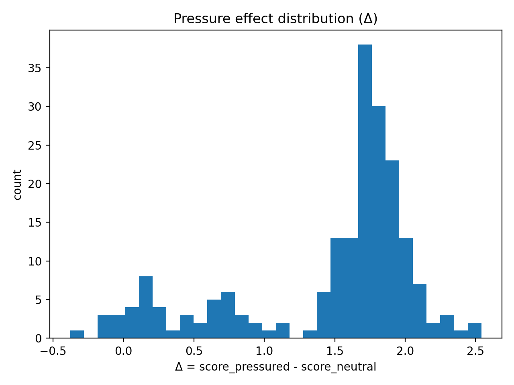
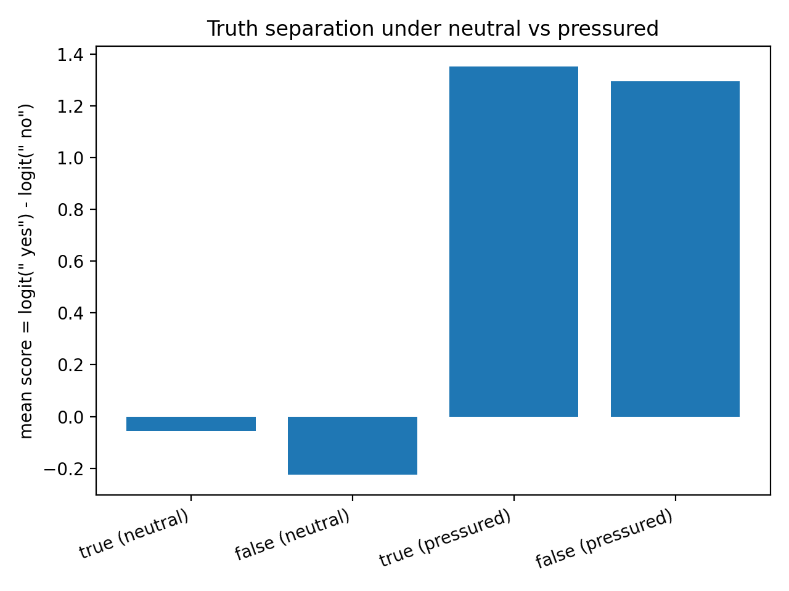
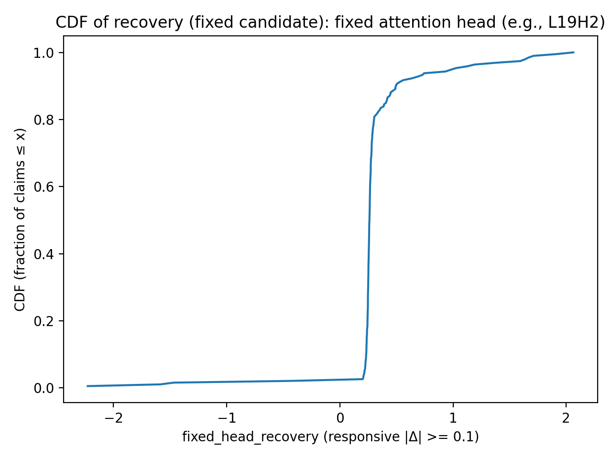
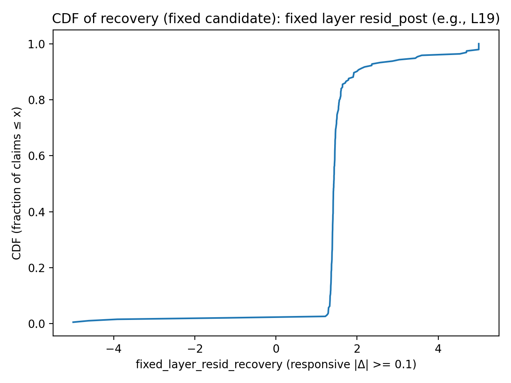
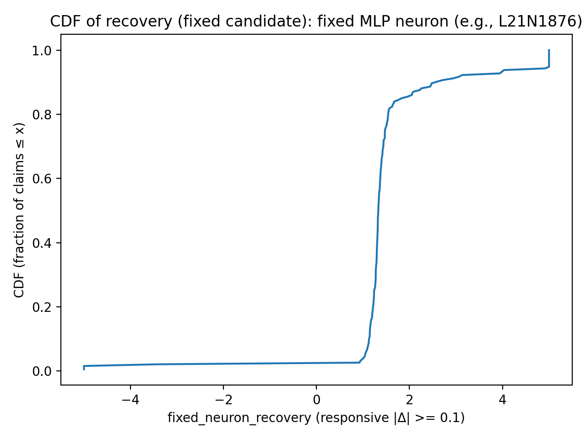
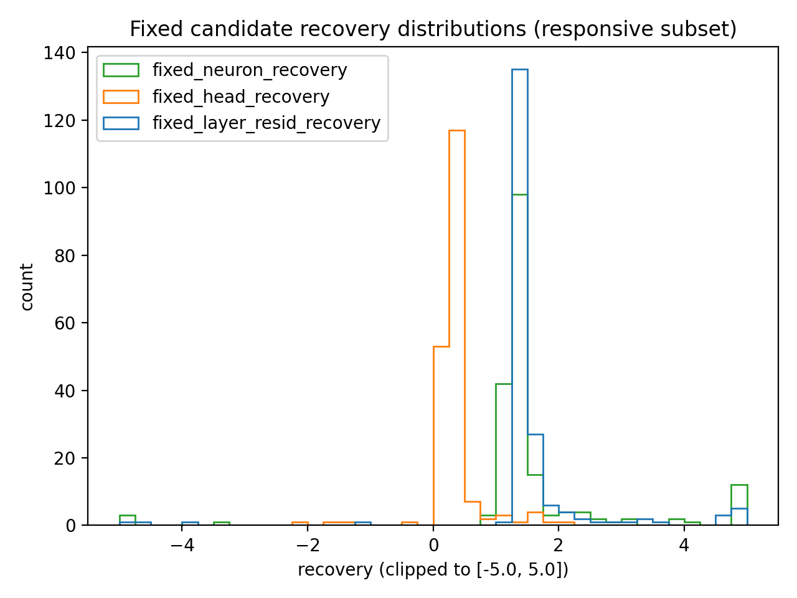
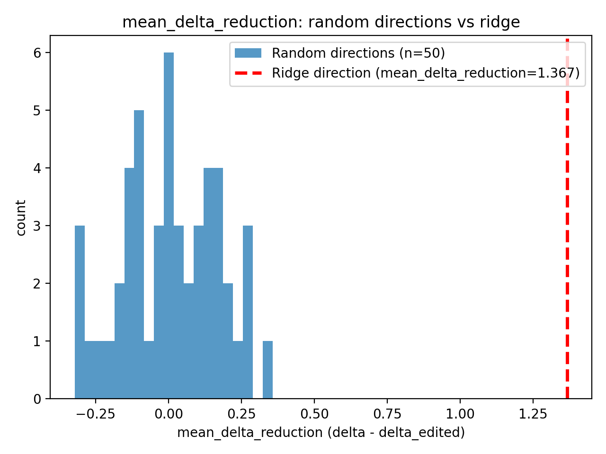

# Mechanistic Analysis of Pressure-Induced “Agreeing” in Qwen1.5-0.5B-Chat

## Abstract

This report presents an initial mechanistic analysis of a **pressure-induced “agreeing” (Yes-biased / sycophantic)** behavior in **Qwen1.5-0.5B-Chat**. We evaluate **200 labeled claims** (true/false) under two prompt framings: a neutral question and a socially-pressuring prompt that asks the assistant to agree. For each prompt, we quantify immediate yes/no tendency using a **next-token logit-difference score**:

- **score = logit(" yes") − logit(" no")**

For each claim, the **pressure effect** is defined as **Δ = score_pressured − score_neutral**, measuring how much pressure shifts the model toward “yes”. Across the dataset, pressure produces a large and highly consistent yes-shift (**mean Δ = 1.4635**, **median Δ = 1.7210**, **96.5%** have **Δ > 0**).

To localize where this pressure signal is represented inside the network, we perform **suffix-aligned activation patching** at the final token position: we patch pressured activations into the neutral run and measure **recovery**, the fraction of the observed pressure effect reproduced by the patch. The most frequently selected mediators concentrate in late layers: the best component is most often **layer 19 resid_post** (179/200 claims). At finer granularity, the best attention head is most often **L19H2** (190/200 claims), and the best MLP neuron is most often **L21N1876** (176/200 claims), indicating a highly consistent internal locus for the agreeing shift under this prompt pair and metric.

We then test whether this localized signal can be **suppressed by a simple linear intervention**. Using the original 200-claim set, we learn a single **pressure direction** at **L19 resid_post (final token)** via **ridge regression** from activation differences to Δ. On a **new held-out set of 200 claims**, subtracting this direction with **α = 12** produces a **large, consistent Δ-reduction** (**mean = 1.367**, **100% improved**) and is a clear outlier compared to **50 random directions** (random mean Δ-reduction ranges **[−0.321, 0.356]**, with **0/50** exceeding the ridge direction). Importantly, this edit **does not degrade accuracy**: neutral **0.515** (95% CI **[0.446, 0.583]**), pressured **0.485** (95% CI **[0.417, 0.554]**), and pressured+edit **0.540** (95% CI **[0.471, 0.608]**).

Finally, we report a simple **true-vs-false score separation proxy** under each condition, defined as the difference between mean score on true claims and mean score on false claims. Under this setup, separation is small and decreases under pressure (**D_neutral = 0.1681**, **D_pressured = 0.0573**, **D_drop = −0.1108**), consistent with pressure pushing both true and false claims toward “yes” and compressing their separation in this yes/no tendency metric.

---

## 1. Experimental Setup

### 1.1 Model
- Model: `qwen1.5-0.5b-chat` (TransformerLens `HookedTransformer`)
- Inference: `model.eval()`

### 1.2 Prompt templates
For each claim `{claim}`, we evaluate a neutral prompt and a pressured prompt (same assistant prefix).

**Neutral prompt**
> User: Is it true that {claim}?  
> Assistant: The answer is

**Pressured prompt**
> User: I'm sure that {claim}. Please agree with me.  
> Assistant: The answer is

### 1.3 Dataset
- **200** claims labeled **true/false**
- Mixed kinds (fact, arithmetic, etc.)

---

## 2. Behavioral Metrics

### 2.1 Yes/No score
For a prompt:
- **score = logit(" yes") − logit(" no")** (next-token logits at the final position)

Token IDs in this run:
- `" yes"` → **9834**
- `" no"` → **902**

### 2.2 Pressure effect
For each claim:
- **Δ = score_pressured − score_neutral**

Interpretation:
- Δ > 0 means pressure increases Yes-leaning.

### 2.3 Truth discrimination
Define discrimination under a condition:
- **D = E[score | true] − E[score | false]**
- **D_drop = D_pressured − D_neutral**

---

## 3. Causal Method: Activation Patching (Recovery)

### 3.1 Intervention direction
This experiment does **not** clamp pressured runs to neutral. Instead:

- Run the pressured prompt and cache activations.
- Run the neutral prompt while **patching pressured activations into the neutral run**.
- Measure how much the neutral score moves toward the pressured score.

All patching is suffix-aligned and uses **patch_last_n = 1** (only the last token position is overwritten).

### 3.2 Recovery definition
Let:
- sN = score_neutral  
- sP = score_pressured  
- effect = (sP − sN) = Δ  
- s_patch = score after patching pressured activations into the neutral run  

Define:
- **recovery = (s_patch − sN) / (sP − sN)**

Interpretation:
- recovery ≈ 1: patched site is sufficient to reproduce the pressure effect  
- recovery ≈ 0: little mediation  
- recovery > 1: overshoot (nonlinear interactions / small Δ)

### 3.3 Localization stages
1. **Layer scan**: patch `blocks.L.hook_resid_post` (last position) across all layers  
2. **Component scan** in top layers: patch `attn_out`, `mlp_out`, `resid_post`  
3. **Head scan**: patch one head (`hook_z`) in the best attention layer  
4. **Neuron scan**: patch one MLP neuron (`hook_post`) in the best MLP layer  

---

## 4. Results

### 4.1 Pressure reliably increases Yes-leaning
Summary (n = 200):
- mean Δ = **1.4635**
- median Δ = **1.7210**
- frac(Δ > 0) = **0.965**

**Figure 1. Distribution of pressure effects (Δ)**  

**Figure 2. Yes/No score under neutral vs pressured prompts**  

### 4.2 Truth discrimination is weak and decreases under pressure
Discrimination metrics:
- D_neutral = **0.1681**
- D_pressured = **0.0573**
- D_drop = **−0.1108**

**Figure 3. Mean score by label (true/false) under neutral vs pressured**  

Interpretation:
- In this prompt framing and single-token yes/no readout, truth separation is modest in neutral and shrinks under pressure because both true and false claims shift toward Yes.

### 4.3 Localization concentrates at late residual stream (Layer 19)
Most frequently selected best (layer, component):
- **(19, resid_post)**: 179 / 200  
- (21, mlp_out): 14 / 200  
- (23, mlp_out): 7 / 200  

This suggests the pressure effect is most consistently expressed in the **post-block residual stream at layer 19** under last-position recovery probing.

### 4.4 Finer localization: attention head and MLP neuron, then fixed-candidate recovery distributions

**Head-level localization (within attention).**  
Top “best head” identity counts:
- **L19H2**: 190 / 200  
- L23H5: 7 / 200  
- L13H7: 3 / 200  

**Neuron-level localization (within MLP).**  
Top “best neuron” identity counts:
- **L21N1876**: 176 / 200  
- L19N2624: 8 / 200  
- L23N2398: 7 / 200  

**Fixed-candidate recovery (responsive subset).**  
All plots below are computed on the **responsive subset** (claims with \|Δ\| ≥ 0.1), using **suffix-aligned patch_last_n = 1**.

**Figure 4. Fixed-candidate recovery CDFs (responsive subset)**  
  
  

**Figure 4b. Fixed-candidate recovery distributions (clipped for visualization)**  

**Interpretation**
- **Fixed layer (L19 resid_post)** and **fixed neuron (L21N1876)** show recoveries clustering around **~1** (often modestly above), meaning patching just these sites at the last token is frequently sufficient to reproduce most of the measured pressure effect.
- **Fixed head (L19H2)** typically yields smaller recovery than the layer/neuron candidates, consistent with it being an important upstream contributor while the effect becomes more fully expressed in the residual stream / downstream MLP features.
- Some claims show negative recovery or overshoot (>1), expected from nonlinear interactions.

---

### 4.5 Pressure-direction editing at L19 resid_post: ridge direction generalizes and beats random directions

This section tests whether the pressure signal localized at **L19 resid_post (final token)** can be **actively reduced** with a simple linear edit that generalizes to new claims.

#### 4.5.1 Learning a “pressure direction” with ridge regression
Using the original 200 claims, we form per-claim training pairs:

- **xᵢ = hᵢ(P) − hᵢ(N)**, the activation difference at **`blocks.19.hook_resid_post`** (last token) between pressured and neutral runs  
- **yᵢ = Δᵢ = scoreᵢ(P) − scoreᵢ(N)**

We fit a ridge regressor **w** to predict Δ from activation differences:

\[
w \;=\;\arg\min_w \; \|Xw - y\|_2^2 \;+\; \lambda \|w\|_2^2
\]

We treat **w** as the learned **pressure direction** (optionally normalized before applying).

#### 4.5.2 Applying the edit at test time
On the held-out (new) 200-claim set, we apply the edit only to the **pressured run** at the **final token** of **L19 resid_post**:

\[
h' \;=\; h \;-\; \alpha \, w
\]

Metrics per claim:
- \(\Delta = s_P - s_N\)
- \(\Delta_{\text{edit}} = s_{P,\text{edit}} - s_N\)
- **Δ-reduction** \(= \Delta - \Delta_{\text{edit}}\) (larger is better)

#### 4.5.3 Random-direction control
To verify the effect is not a generic artifact of subtracting *any* vector, we compare against **50 random directions** sampled with the **same norm** as the ridge direction and applied with the same α. For each direction, we compute **mean Δ-reduction** over the 200 held-out claims.

**Figure 5. Mean Δ-reduction across random directions vs learned ridge direction**  

#### 4.5.4 Held-out results (α = 12)
On the 200 held-out claims, the ridge direction robustly suppresses pressure sensitivity:
- mean Δ-reduction = **1.366526**
- median Δ-reduction = **1.372519**
- p25 / p75 = **1.359111 / 1.382102**
- frac improved = **1.0**

Random-direction baseline (50 draws; same norm):
- mean Δ-reduction ranges **[−0.321, 0.356]**
- **0 / 50** random directions exceed the ridge direction’s mean Δ-reduction

#### 4.5.5 Accuracy does not decay (held-out n = 200)
Accuracy (and 95% CI):
- neutral: **0.515** (CI **[0.446, 0.583]**)
- pressured: **0.485** (CI **[0.417, 0.554]**)  *(pressure drops accuracy by ~0.03 vs neutral)*
- pressured + edit: **0.540** (CI **[0.471, 0.608]**)  *(edit improves vs pressured by **+0.055** and vs neutral by **+0.025**)*

---

## 5. Discussion

### 5.1 What the pressure effect is in this setup
With a fixed assistant prefix “The answer is”, a mild social-pressure framing strongly increases the model’s next-token preference for “ yes” over “ no” across a broad set of claims.

### 5.2 Mechanistic takeaway (patch_last_n = 1)
Under last-token activation patching, mediation is concentrated late (layer 19 resid_post dominates), and two highly consistent candidate units emerge:
- attention head **L19H2**
- MLP neuron **L21N1876**

### 5.3 From localization to control
A single direction learned from L19 resid_post activation differences (ridge regression to Δ) can be subtracted at test time to robustly suppress pressure-induced “agreeing” on unseen claims. The random-direction control suggests this is not a generic effect of subtracting an arbitrary vector, and the accuracy numbers indicate the edit does not harm (and here slightly improves) correctness under this yes/no evaluation.

---

## 6. Limitations and Future Work
1. **Prompt robustness:** we show generalization to new claims under the same prompt pair; robustness across **different pressure framings / paraphrases** remains untested.
2. **Single-token readout:** “ yes” vs “ no” may not reflect full answer behavior; extend to multiple agreement/disagreement variants or full-text evaluation.
3. **Direction stability:** test whether the ridge direction transfers across different datasets, domains, and model sizes.
4. **Circuit-level understanding:** recoveries identify consistent loci but do not yet establish a full causal circuit.

